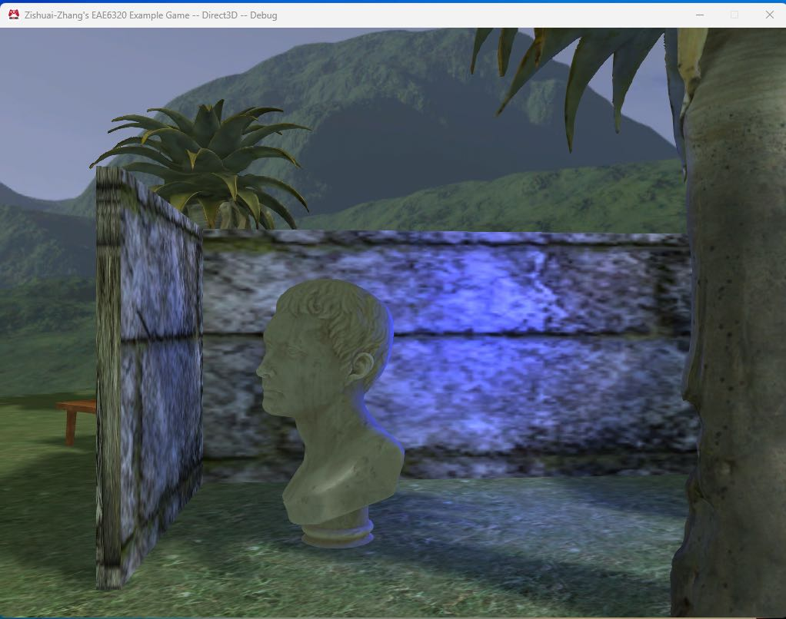
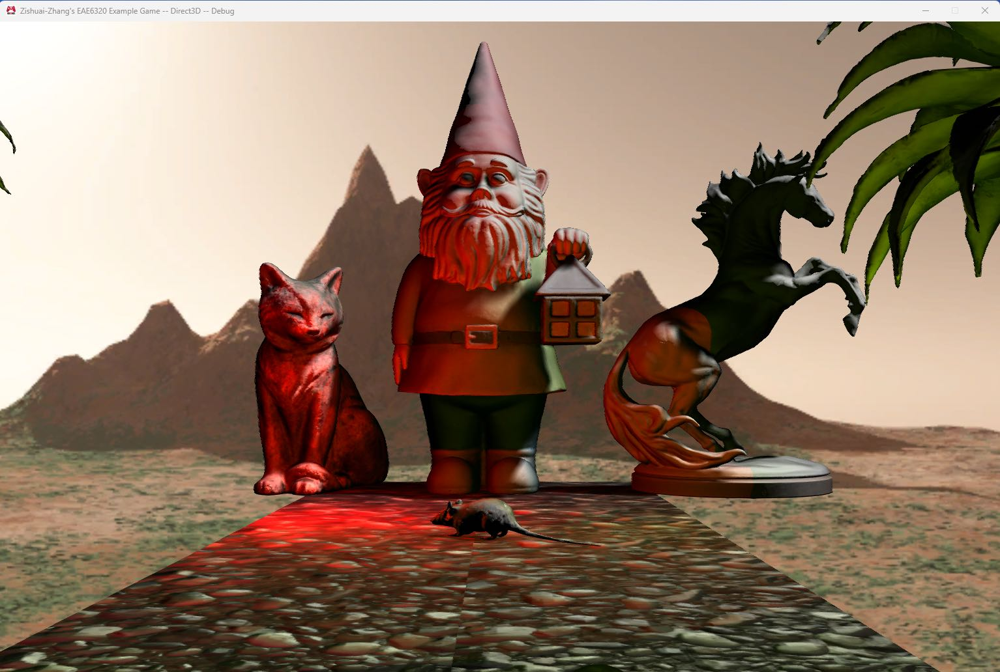
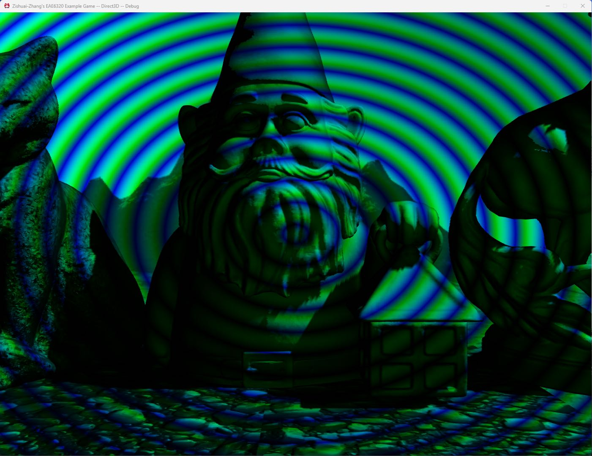
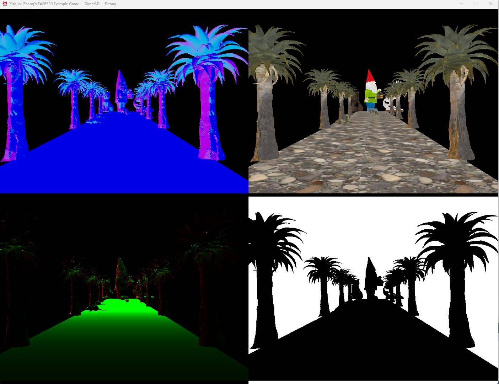
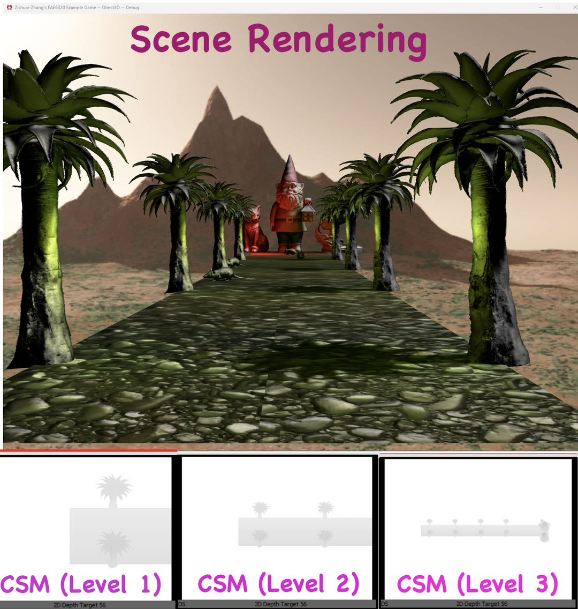
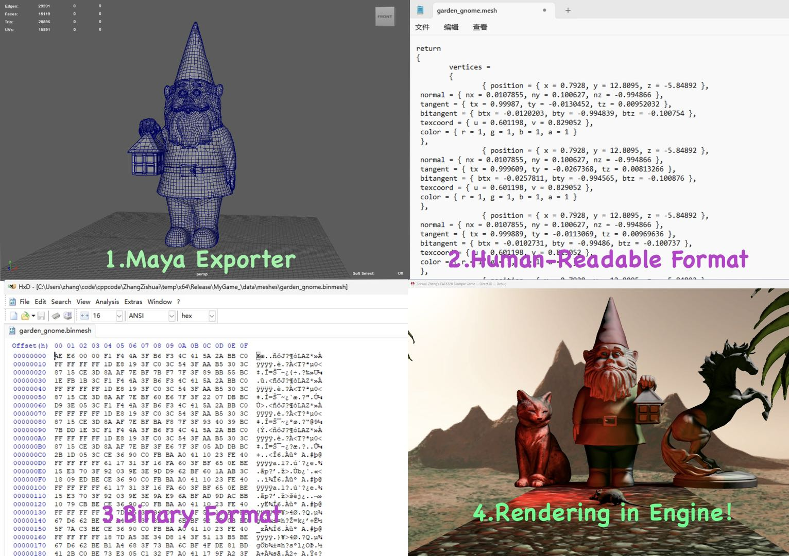

# 🎮 Graphics Module in a Lightweight Game Engine

This repository contains the **graphics module** of a custom game engine.  
It features a modular **rendering framework**, multiple **rendering techniques**, and an **optimized asset pipeline**. 

📌 **Each feature is implemented in a separate branch.** Switch branches to explore specific functionalities.

🔗 **Technical Blog:** [Game Engine Blog](https://zhangzs11.github.io/categories/Game-Engine/)  

## ✨ Features Overview

### 1️⃣ Framebuffer Management & Dual-Threaded Rendering Framework  
🔹 **Effect & Mesh Submission System:**
🔹 **Optimized Framebuffer Structures:**
🔹 **Game Object & Camera Interfaces:** 

---

### 2️⃣ Rendering Pipeline  
🔹 **Forward & Deferred Rendering:** Supports multiple rendering pipelines with normal mapping, FXAA, and skybox.  
🔹 **Shadow Mapping Techniques:** Implemented Cascaded Shadow Maps (CSM), Percentage-Closer Filtering (PCF), and Moving Light Adjustments in Texel-Sized increments.  
🔹 **Optimized G-buffer Rendering:** Reduced storage overhead in deferred shading.  

#### 🌟 Rendering Showcase

<p align="center">
  
  
  
</p>
<p align="center">
  
  
</p>

---

### 3️⃣ Mesh Asset Data Pipeline  
🔹 **Maya Export Plugin:** Converts 3D models into human-readable Lua files for efficient asset integration.  
🔹 **Mesh Builder Tool:** Converts Lua-based mesh data into **binary format**, supporting dynamic selection of **16-bit or 32-bit index data** based on performance needs.  
🔹 **Optimized for Performance & Memory Usage.**  

<p align="center">
  
</p>

## 📂 How to Explore and Run (Windows + Visual Studio 2019)

### 1️⃣ Clone the Repository
```sh
# Clone the repository
git clone https://github.com/zhangzs11/GameGraphicsEngine
cd GameGraphicsEngine
```

### 2️⃣ Switch to a Feature Branch
```sh
# Checkout a specific feature branch
git checkout Graphics_CascadeShadowMap # Example: Switch to CascadeShadowMap implementation
```

### 3️⃣ Open in Visual Studio 2019
Click Open a project or solution, then select the .sln file in the repository folder.
